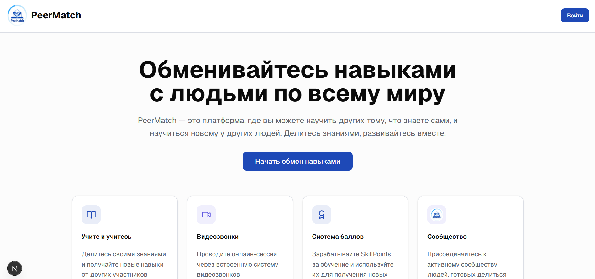

<div align="center">

# PeerMatch
<a href=https://peer-match.ru>
PeerMatch Website Link
</a>


    
  
</div>

## Краткий тизер

**PeerMatch** - это сервис упрощающий обмен знаниями. Он предлагает новую для рынка концепцию прямого P2P образования с внутренней экономической системой.



## Содержание

- [Установка и развертывание](#установка-и-развертывание)
  - [Локальная разработка](#локальная-разработка)
  - [Развертывание через Ansible](#развертывание-через-ansible)
- [Архитектура проекта](#архитектура-проекта)
- [Подробное описание переменных окружения](#подробное-описание-переменных-окружения)

## Установка и развертывание

### Локальная разработка

#### Предварительные требования

- Docker и Docker Compose
- Ansible

#### Быстрый старт с Docker

1. **Клонируйте репозиторий:**
```bash
git clone <repository-url>
cd MPIThack
```

2. **Создайте файл переменных окружения:**
```bash
cp env.example .env
```

3. **Настройте переменные окружения в `.env`:**
Отредактируйте файл `.env` и укажите необходимые значения (см. раздел [Переменные окружения](#переменные-окружения))

4. **Запустите проект:**
```bash
# Запуск в режиме разработки
docker-compose -f docker-compose.dev.yml up --build

# Или запуск в продакшн режиме
docker-compose up --build
```

После запуска сервисы будут доступны по адресам:
- Frontend: http://localhost:3000
- Backend API: http://localhost:8000/api
- Caddy (прокси): http://localhost:80

#### Локальная разработка без Docker

**Backend (FastAPI):**

1. **Установите зависимости:**
```bash
cd backend
uv sync
```

2. **Настройте переменные окружения:**
```bash
cp .env.example .env
# Отредактируйте .env для локальной разработки
```

3. **Запустите сервер:**
```bash
uv run uvicorn src.main:app --host 0.0.0.0 --port 8000 --reload
```

**Frontend (Next.js):**

1. **Установите зависимости:**
```bash
cd frontend
npm install
```

2. **Запустите dev сервер:**
```bash
npm run dev
```

### Развертывание через Ansible

#### Предварительные требования

- Ansible 2.9+
- SSH доступ к целевым серверам
- Python на целевых серверах

#### Настройка

1. **Настройте инвентарь:**
Отредактируйте файл `deploy/ansible/inventory/hosts` и укажите ваши серверы:

```ini
[web]
your-server.com ansible_host=your-server-ip ansible_user=root

[db]
your-db-server.com ansible_host=your-db-server-ip ansible_user=root
```

2. **Настройте переменные:**
```bash
cd deploy/ansible
cp secrets.example.yml secrets.yml
# Отредактируйте secrets.yml с вашими значениями
```

3. **Настройте групповые переменные:**
Отредактируйте файл `deploy/ansible/group_vars/all.yml`

4. **Настройте секреты**: скопируйте файл `deploy/ansible/secrets.example.yml` в файл `deploy/ansible/secrets.yml`, заменив секреты на ваши перменные

#### Развертывание

```bash
cd deploy/ansible
ansible-playbook -i inventory/hosts playbook.yml
```

Роли Ansible:
- `docker` - установка и настройка Docker
- `postgresql` - установка и настройка PostgreSQL
- `app` - развертывание приложения
- `caddy` - настройка Caddy как reverse proxy

## Архитектура проекта

### Структура репозитория

```
MPIThack/
├── backend/                 # Backend (FastAPI + Python)
│   ├── src/
│   │   ├── api/            # API endpoints и роутеры
│   │   ├── core/           # Конфигурация и DI контейнер
│   │   ├── db/             # Подключение к базе данных
│   │   ├── models/         # SQLAlchemy модели
│   │   ├── repositories/   # Слой доступа к данным
│   │   ├── schemas/        # Pydantic схемы
│   │   └── services/       # Бизнес-логика
│   ├── alembic/            # Миграции базы данных
│   ├── pyproject.toml      # Python зависимости
│   └── Dockerfile          # Docker образ для backend
├── frontend/               # Frontend (Next.js + React)
│   ├── app/               # Next.js App Router
│   ├── components/        # React компоненты
│   ├── hooks/            # Custom React hooks
│   ├── lib/              # Утилиты и конфигурация
│   ├── services/         # API клиенты
│   ├── styles/           # CSS стили
│   ├── package.json      # Node.js зависимости
│   └── Dockerfile        # Docker образ для frontend
├── deploy/               # Конфигурация развертывания
│   └── ansible/         # Ansible playbooks и роли
├── docker-compose.yml    # Production Docker Compose
├── docker-compose.dev.yml # Development Docker Compose
├── docker-compose.base.yml # Базовые сервисы (Redis, Qdrant)
└── .env_docker          # Пример переменных окружения
```

### Технологический стек

**Backend:**
- **FastAPI** - веб-фреймворк
- **SQLAlchemy** - ORM для работы с базой данных
- **Alembic** - миграции базы данных
- **PostgreSQL** - основная база данных
- **Redis** - кеширование и сессии
- **Qdrant** - векторная база данных для поиска
- **GigaChat** - AI embeddings
- **Dishka** - DI контейнер
- **WebSockets** - real-time коммуникация

**Frontend:**
- **Next.js 15** - React фреймворк
- **TypeScript** - типизация
- **Tailwind CSS** - стилизация
- **Radix UI** - UI компоненты
- **React Hook Form** - формы
- **Zod** - валидация
- **Jitsi/100ms** - видео коммуникация

**Инфраструктура:**
- **Docker** - контейнеризация
- **Caddy** - reverse proxy
- **Ansible** - автоматизация развертывания

### Архитектурные принципы

1. **Clean Architecture** - разделение на слои (API, Service, Repository)
2. **Dependency Injection** - использование Dishka для управления зависимостями
3. **API-First** - четкое разделение frontend и backend
4. **Microservices-ready** - готовность к разделению на микросервисы
5. **Real-time** - поддержка WebSocket для live коммуникации

## Разработка

### Добавление новых зависимостей

**Backend:**
```bash
cd backend
uv add package-name
```

**Frontend:**
```bash
cd frontend
npm install package-name
```

### Создание миграций

```bash
cd backend
docker-compose exec backend alembic revision --autogenerate -m "Description of changes"
docker-compose exec backend alembic upgrade head
```

### Линтинг и форматирование

**Backend:**
```bash
cd backend
uv run ruff check .
uv run ruff format .
```

**Frontend:**
```bash
cd frontend
npm run lint
```

## Подробное описание переменных окружения

Для подробного описания всех переменных окружения, их типов, обязательности и примеров значений, см. файл [ENVIRONMENT_VARIABLES.md](./ENVIRONMENT_VARIABLES.md).

Этот документ содержит:
- Полное описание каждой переменной окружения
- Примеры значений для development и production
- Рекомендации по безопасности
- Конфигурационные файлы для разных окружений
